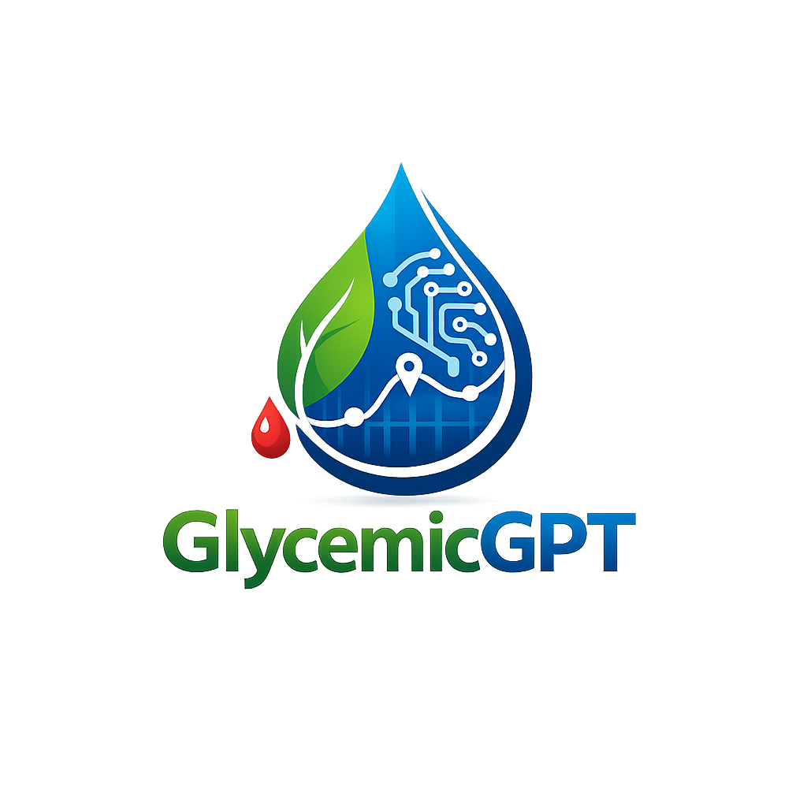

<p align="center">
  
</p>

<h1 align="center">GlycemicGPT</h1>

<p align="center">
  <strong>Open source AI-powered diabetes management platform.</strong><br/>
  <em>Because no one should manage diabetes alone.</em>
</p>

<p align="center">
  <a href="https://github.com/GlycemicGPT/GlycemicGPT/actions/workflows/ci.yml"></a>
  <a href="https://github.com/GlycemicGPT/GlycemicGPT/actions/workflows/container-build.yml"></a>
  <a href="https://github.com/GlycemicGPT/GlycemicGPT/actions/workflows/android.yml"></a>
  <a href="https://github.com/GlycemicGPT/GlycemicGPT/actions/workflows/security-full-suite.yml"></a>
</p>

<p align="center">
  <a href="https://github.com/GlycemicGPT/GlycemicGPT/releases/tag/dev-latest"></a>
  <a href="https://github.com/GlycemicGPT/GlycemicGPT/releases/latest"></a>
  <a href="LICENSE"></a>
</p>

<p align="center">
  <a href="https://github.com/GlycemicGPT/GlycemicGPT/issues"></a>
  <a href="https://github.com/GlycemicGPT/GlycemicGPT/pulls"></a>
  <a href="https://github.com/GlycemicGPT/GlycemicGPT/actions/workflows/renovate.yml"></a>
  <a href="https://coderabbit.ai" target="_blank" rel="noopener noreferrer"></a>
</p>

<p align="center">
  <a href="#overview">Overview</a> •
  <a href="#quick-start">Quick Start</a> •
  <a href="#architecture">Architecture</a> •
  <a href="#development">Development</a> •
  <a href="#contributing">Contributing</a> •
  <a href="#support-the-project">Support</a> •
  <a href="#disclaimer">Disclaimer</a>
</p>

---

> **IMPORTANT SAFETY WARNING**
>
> This software is **NOT** designed to replace your endocrinologist or healthcare provider. GlycemicGPT provides AI-generated suggestions only and should be used as a supplementary tool alongside professional medical care.

---

> **ALPHA SOFTWARE** -- This project is under active development. It is functional and in daily use by the developer, but has not been broadly tested. Use at your own risk and always consult your healthcare provider.

---

## Overview

GlycemicGPT bridges the gap between diabetes device data and actionable AI-powered insights. It connects to your Dexcom G7 CGM and Tandem insulin pump via BLE, displays real-time glucose trends, and provides AI-generated analysis of your diabetes data.

**Currently supported devices:**

| Device | Type | Connection | Status |
|--------|------|------------|--------|
| Dexcom G7 | CGM | Cloud API | Verified |
| Tandem t:slim X2 | Insulin Pump | BLE (direct) + Cloud API | Verified |
| Tandem Mobi | Insulin Pump | BLE (direct) + Cloud API | Protocol-compatible (see note) |

> **Tandem Mobi note:** The Mobi uses the same BLE protocol, authentication, and data formats as the t:slim X2. Our Tandem plugin is protocol-compatible with both models, but **Mobi support has not been verified against physical hardware**. Protocol compatibility does not guarantee correct operation on untested devices. Use with Mobi hardware is entirely at your own risk -- see [MEDICAL-DISCLAIMER.md](MEDICAL-DISCLAIMER.md) for full liability terms. Insulin delivery (bolus/control) requires a user-built plugin compiled from source (see [CONTRIBUTING.md](CONTRIBUTING.md#device-control-plugins)). If you have a Mobi and can help validate, please open an issue.

Support for additional pumps and CGMs is planned for future releases. The mobile app uses a [capability-based plugin architecture](docs/plugin-architecture.md) designed for extensibility -- see [CONTRIBUTING.md](CONTRIBUTING.md) if you'd like to help add support for your device.

**What it does:**

- Real-time glucose monitoring with trend charts and Time in Range tracking
- BLE connectivity to Tandem pumps (basal, bolus, IoB, reservoir, battery)
- AI-powered daily briefs, meal analysis, and pattern recognition (BYOAI -- bring your own AI key)
- Configurable alerts with Telegram delivery and caregiver escalation
- Android phone app + Wear OS companion with watch face complications
- Self-hosted Docker stack with web dashboard and REST API

**Key Principles:**

- **Suggestions only** -- does not control medical devices
- **BYOAI architecture** -- bring your own AI provider (Claude, OpenAI, Ollama, or any OpenAI-compatible endpoint)
- **Self-hosted** -- your data stays on your infrastructure (Docker or Kubernetes)
- **Safety-first** -- pre-validation layer, emergency escalation, medical disclaimers

## Quick Start

```bash
# Clone the repository
git clone https://github.com/GlycemicGPT/GlycemicGPT.git
cd GlycemicGPT

# Copy environment file
cp .env.example .env

# Start all services
docker compose up --build -d
```

Services will be available at:

- **Web UI:** http://localhost:3000
- **API:** http://localhost:8000
- **API Docs:** http://localhost:8000/docs

## Architecture

| Component | Technology |
|-----------|------------|
| Frontend | Next.js 15, React 19, Tailwind CSS, shadcn/ui |
| Backend | FastAPI, Python 3.12 |
| Mobile | Kotlin, Jetpack Compose, BLE |
| Wear OS | Kotlin, Wear Compose, Watch Face |
| Plugin System | Extensible device support via [plugin architecture](docs/plugin-architecture.md) |
| AI Sidecar | TypeScript, Express, multi-provider proxy |
| Database | PostgreSQL 16, SQLAlchemy 2.0 |
| Cache | Redis 7 |

## Development

```bash
# Start the full stack
docker compose up --build -d

# Verify services
curl localhost:8000/health   # API
curl localhost:3456/health   # AI sidecar
# Web UI at http://localhost:3000
```

See [CONTRIBUTING.md](CONTRIBUTING.md) for full development setup, branching strategy, and code style guidelines.

## Contributing

We welcome contributions! Please read our [Contributing Guide](CONTRIBUTING.md) before submitting a pull request.

- [Bug Reports](https://github.com/GlycemicGPT/GlycemicGPT/issues/new?template=bug_report.yml)
- [Feature Requests](https://github.com/GlycemicGPT/GlycemicGPT/issues/new?template=feature_request.yml)
- [Mobile App Issues](https://github.com/GlycemicGPT/GlycemicGPT/issues/new?template=mobile_report.yml)
- [Discussions](https://github.com/GlycemicGPT/GlycemicGPT/discussions) (questions, ideas, show & tell)

## Support the Project

GlycemicGPT is free, open source, and built by volunteers. If you find it useful, consider supporting the project:

<p align="center">
  <a href="https://github.com/sponsors/GlycemicGPT"><strong>GitHub Sponsors</strong></a> &middot;
  <a href="https://opencollective.com/glycemicgpt"><strong>Open Collective</strong></a>
</p>

Your support helps cover infrastructure costs (hosting, domain, CI, signing certificates), org seats for committers and maintainers, and future maintainer stipends. All Open Collective transactions are public. See [GOVERNANCE.md](GOVERNANCE.md#compensation) for how funding is managed.

## License

This project is licensed under the **GNU General Public License v3.0 (GPL-3.0)**. See the [LICENSE](LICENSE) file for details.

---

## Disclaimer

> See [MEDICAL-DISCLAIMER.md](MEDICAL-DISCLAIMER.md) for the complete medical and regulatory disclaimer.

> **USE AT YOUR OWN RISK**

### This Software is Not Medical Advice

GlycemicGPT is experimental open-source software intended for educational and informational purposes only. It is **NOT** approved by the FDA or any regulatory body for medical use.

### AI Limitations

**AI can and will make mistakes.** Large language models (LLMs) are known to:

- **Hallucinate** - generate plausible-sounding but incorrect information
- **Misinterpret data** - draw incorrect conclusions from your glucose readings
- **Provide outdated information** - not reflect the latest medical guidelines
- **Lack context** - not understand your complete medical history

### Critical Warnings

1. **Do not replace professional medical care.** Always consult with your endocrinologist, diabetes educator, or healthcare provider before making any changes to your diabetes management.

2. **Verify all suggestions.** Any insulin dosing, carb ratio, or correction factor suggestions from AI must be verified with your healthcare team before use.

3. **This is not a medical device.** GlycemicGPT does not control any medical devices and provides suggestions only.

4. **Use extreme caution.** Incorrect diabetes management can result in severe hypoglycemia, diabetic ketoacidosis (DKA), or other life-threatening conditions.

### Limitation of Liability

THE AUTHORS AND CONTRIBUTORS OF THIS SOFTWARE ARE NOT LIABLE FOR ANY DAMAGES, INJURIES, OR ADVERSE HEALTH OUTCOMES RESULTING FROM THE USE OF THIS SOFTWARE. BY USING GLYCEMICGPT, YOU ACKNOWLEDGE THAT:

- You are using this software at your own risk
- You will not rely solely on AI-generated suggestions for medical decisions
- You understand that AI can make errors and hallucinate
- You will maintain regular care with qualified healthcare professionals
- You accept full responsibility for any decisions made based on this software's output

**If you experience a diabetes emergency, contact your healthcare provider or emergency services immediately. Do not rely on this software for emergency medical guidance.**

---

<p align="center">
  <sub>Built with care for the diabetes community. Stay safe. 💙</sub>
</p>
